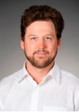
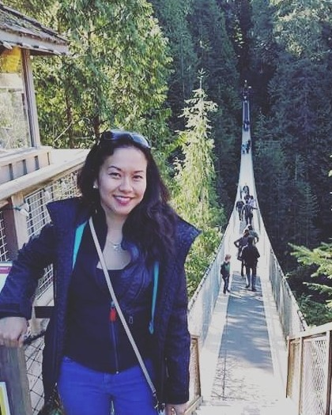
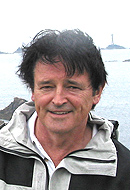
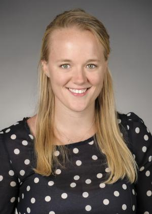
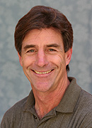
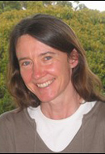

***
### Contact
E-mail: rocketoutfall@lists.bren.ucsb.edu

## Bren Working Group
### Elise Wall
#### Project Manager

Elise is interested in remediation programs associated with technological advances. She has a strong analytical streak, is a capable programmer, wet-bench chemist, and visual artist. Currently, she is pursuing a Master's focused on Pollution Prevention and Remediation at UCSB's Bren School of Environmental Science and Management. Previously she recieved her B.S. in Biological Chemistry from Beloit College, and spent three years building professional experience with Global and U.S. Federal Chemical Regulatory Compliance, Wet/Bench Chemistry and Protocol Design, Data Analysis, Database Management, Process Automation, and Scientific Instrument Operations and Repair.

### Lina Barbosa
#### Data Manager

Lina's research interests include environmental equity and statisitcal analysis of enironmental problems. As a master's student at Bren, Lina is specializing in Conservation Planning.

### Alex Tremblay
#### Financial Manager

Alex has a background in classical French cuisine, ecology and native habitat restoration. He has a B.S. in Environmental Studies with a focus in terrestrial ecology, community sustainability and professional writing from the University of California, Santa Barbara. His focus of study at the Bren School is Pollution Prevention and Remediation. He hopes to work with companies and community organizations to reduce the pollution footprint of industrial and urban activities. 

### Sodavy Ou
#### Chief Editor

Sodavy loves running around in the Redwoods and along California's beaches. She has a B.A. in Environmental Studies/Biology from UC Santa Cruz and worked in marine and energy conservation. Currently, she is pursuing a Master's Degree from UC Santa Barbara's Bren School of Enironmental Science & Management. Sodavy is interested in pollution prevention and remediation, specifically in the transport of pollution in rivers and streams.   

## Advisors
### Thomas Dunne
#### Faculty Advisor

Thomas Dunne conducts field and theoretical research in fluvial geomorphology and in the application of hydrology, sediment transport, and geomorphology to landscape management and hazard analysis. Since coming to the Bren School in 1996, Professor Dunne has studied erosion in the Andes, and hydrology, sediment transport, and floodplain sedimentation in the Amazon River basin of Brazil and Bolivia and the Central Valley of California.

### Colleen Devlin
#### PhD Advisor

 

### Frank Davis 
#### External Advisor

Frank Davis brings conservation science and geographical analysis to bear in land use planning and the conservation of wild species. Davis heads the Biogeography Lab at the Bren School, and his research focuses on the landscape ecology of California plant communities, the design of protected-area network, rangeland and farmland conservation, and the biological implications of regional climate change.

### Christina (Naomi) Tague
#### External Advisor 

Naomi's research is focused on the interactions between hydrology and ecosystem processes and, specifically, how eco-hydrologic systems are altered by changes in land use and climate. Much of her work involves developing and using spatial simulation models to integrate data from multiple field-based monitoring studies in order to generalize results to larger watersheds. Professor Tague is currently modeling the impacts of climate change on stream-flow patterns in the western United States and examining how urbanization alters drainage patterns and associated biogeochemical cycling in watersheds in Baltimore, Maryland, and Southern California.
